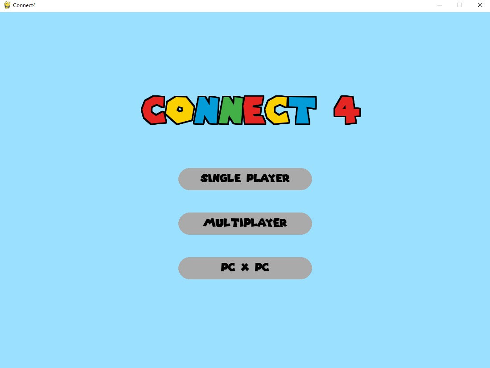
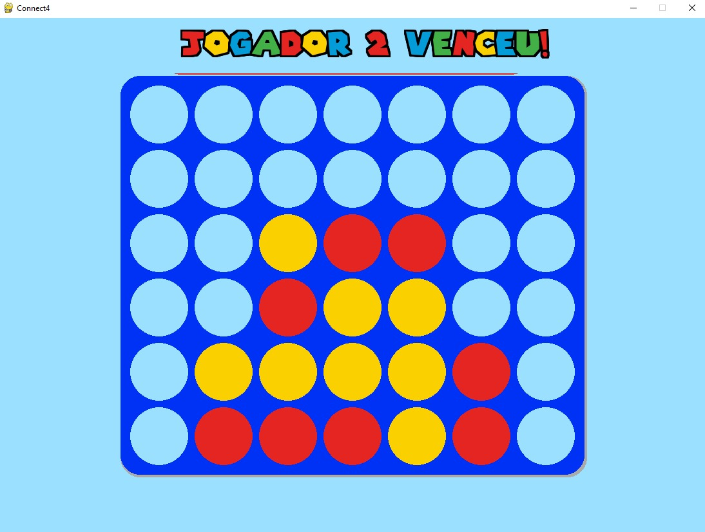
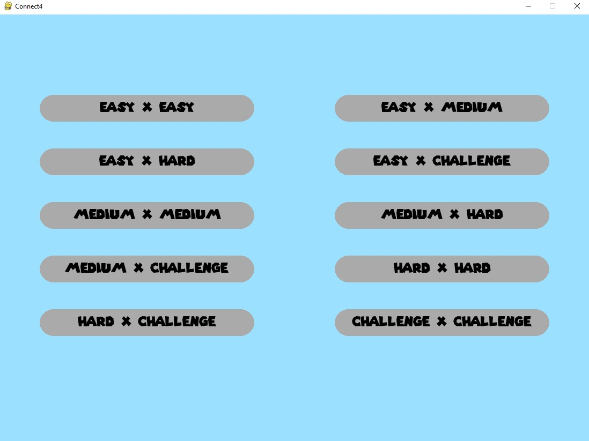
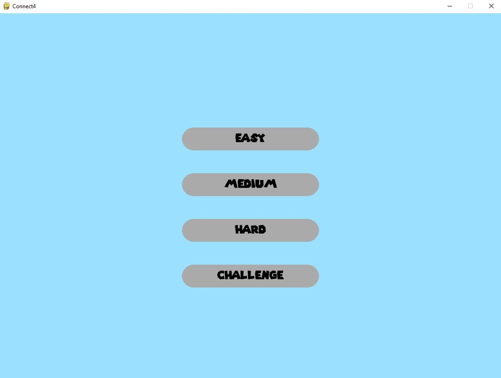

# Projeto IA: Connect 4 com MCTS e ID3

Este projeto implementa o jogo Connect 4 com interface gráfica, permitindo que usuários joguem partidas em um tabuleiro visual. É possível alternar entre os modos humano vs humano, humano vs IA e IA vs IA.

A Inteligência Artificial do projeto combina os algoritmos Monte Carlo Tree Search (MCTS) com UCT e uma Árvore de Decisão ID3 para avaliar e selecionar as melhores jogadas.

## Pré-requisitos

- [Python 3.x](https://www.python.org/downloads/)
- pip (gerenciador de pacotes do Python - normalmente já incluso na instalação do Python)

## Funcionalidades

- **Interface gráfica interativa:** Jogue partidas de Connect 4 em um tabuleiro visual intuitivo.
- **MCTS (Monte Carlo Tree Search):** Algoritmo que simula cenários para escolher jogadas estratégicas.
- **ID3 (Árvore de Decisão):** Algoritmo para análise e previsão de movimentos.
- **Modos de jogo:** Humano vs Humano, Humano vs IA, IA vs IA.

## Instalação e Execução

1. **Navegue até a pasta do projeto:**
   ```bash
   cd caminho/para_o_projeto
   ```

2. **Instale as dependências:**
   ```bash
   pip install -r requirements.txt
   ```

3. **Execute o jogo:**
   ```bash
   python main.py
   ```

## Sobre

- Desenvolvido para a cadeira de Inteligência Artificial da Universidade do Porto.
- Projeto modular, fácil de adaptar para novas estratégias de IA ou diferentes regras do jogo.

---

## Interface Gráfica

### Menu Principal


### Tabuleiro do Jogo


### Escolha de Dificuldade (IA vs IA)


### Escolha de Dificuldade (Single Player)

